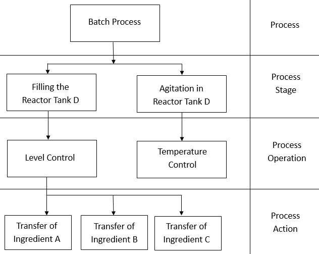
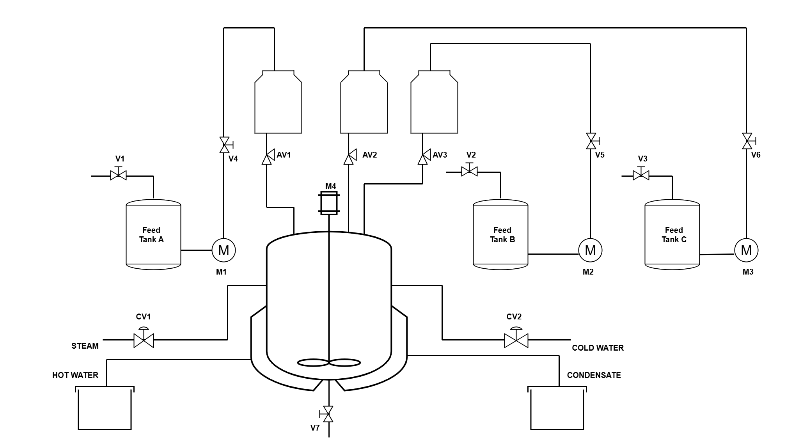
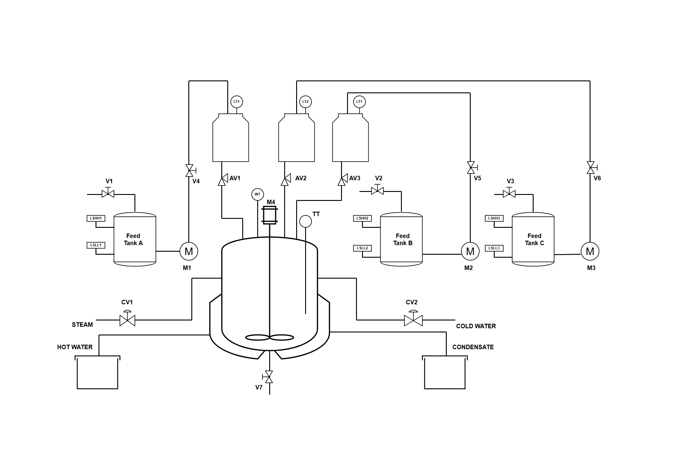
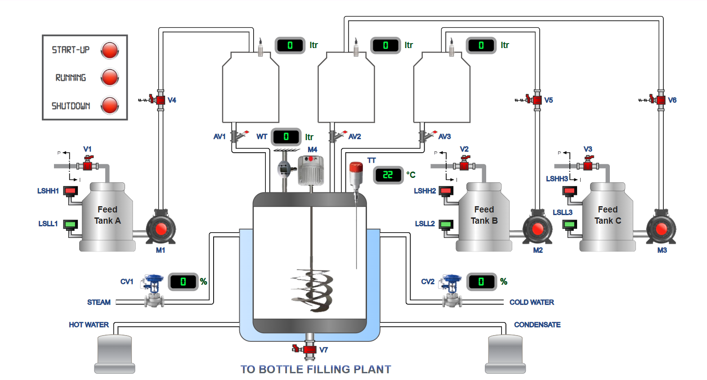

## Theory

The batch and bottle filling pilot plant will be a fully automated, state-of-the-art facility designed to simulate real-world industrial production environments. This pilot plant is equipped with the latest technology and is controlled by a Programmable Logic Controller (PLC), which is the brain of the system. The PLC is a computer-based controller that continuously monitors and controls the entire production process, ensuring efficient, reliable, and accurate operation.

#### Overview of the Plant

The batch and bottle filling pilot plant required to be designed to mimic the operations of a real-world manufacturing facility. The plant consists of various components, including tanks, pumps, valves, sensors, and actuators, which work together to produce a batch of product and fill it into bottles. The plant is capable of producing a variety of products, including liquids, and can be configured to meet specific production requirements.

#### PLC Control System

The PLC control system is the central nervous system of the plant, responsible for controlling and monitoring every aspect of the production process. The PLC receives input from various sensors and transmitters, processes the data, and sends output signals to the actuators to control the plant's operations. The PLC program is designed to ensure that the plant operates safely, efficiently, and within specified parameters.
		
#### Key requirements of customers about the Plant

#### Fully Automatic Operation :

The plant is capable of operating independently, with minimal human intervention, making it an ideal platform for demonstrating the benefits of automation.

#### PLC Control :

The plant is controlled by a PLC, which provides a realistic and industry-relevant learning experience.

#### Real-Time Monitoring :

The plant is equipped with real-time monitoring systems, allowing operators to track the production process and make adjustments as needed.

#### Flexibility and configurability :

The plant can be configured to produce a variety of products, making it an ideal platform for demonstrating the principles of batch processing and filling.

#### Safety Features :

The plant is designed with safety in mind, incorporating features such as emergency stops, alarm systems, and safety interlocks to ensure a safe operating environment.

#### About the Plant :

#### Batch Process pilot plant details :

All the tanks are made of Stainless Steel as the same will be used for food grade. The Reactor Tank is jacketed so as to provide the steam heating for desire batch product. The tanks are named as Tank A, Tank B, Tank C, and a Reactor Tank.  Tank A, B, and C are for Ingredient feed and the Reactor tank is for product production. Tank A, B and C contains the level switches. The Tank D and Reactor tank contain the level transmitter. Tank A, B and C are of same dimension and same capacity as shown:

#### Batch Process Model 

A process flow diagram (PFD) is commonly used in chemical and process engineering to indicate the general flow of plant processes and equipment. The PFD displays the relationship between major equipment of a plant facility and does not show minor details such as piping details and designations.

#### Analog Input (AI)

Field devices that provide an analog output as their signal (analog sensors or transducers) are usually connected to transmitters, which in turn, send the analog signal to the module. A transducer converts a field device's variable (i.e., pressure, temperature, etc.) into a very low-level electrical signal (current or voltage) that can be amplified by a transmitter and then input into the analog interface.

#### The Analog Inputs for Batch Process as follows :

1. Capacitive Level Transmitter (LT4)
2. Ultrasonic Level Transmitter (LT3)
3. Temperature Transmitter for Reactor (TT4)
4. Temperature Transmitter for Condensate temperature (TT5)
5. Weight Transmitter (WT)

#### Analog Output

Like analog inputs, analog output interfaces are usually connected to controlling devices through transducers. These transducers amplify, reduce, or change the discrete voltage signal into an analog signal, which in turn, controls the output device. The Analog Output for Batch Process as follows:

1. Control Valve for steam inlet (CV)
2. Control Valve 1 for cold water inlet (CV1)

#### Digital Input (DI)

The discrete input (DI) system provides the physical connection between the central processing unit and field devices that transmit. Digital signals are non-continuous signals that have only two states ON and OFF. Through various interface circuits and field devices (limit switches, transducers, etc.), the controller senses and measures physical quantities (e.g., proximity, position, motion, level, temperature, pressure, current, and voltage) associated with a machine or process.

#### The List of Digital Input  (DI) for Batch Process as follows :

- Conductivity Type Low Level Switch (LSLL1)
- Conductivity Type High Level Switch (LSHH1)
- High Level Displacer Switch (LSHH2)
- Low Level Magnetic Float Switch (LSLL2)
- High Level Capacitive Switch (LSHH3)
- Low Level Vibrating Fork Switch (LSLL3)
- ACK PB
- Emergency Stop

#### Digital Output (DO)

The discrete output (DO) system provides the physical connection between the central processing unit and field devices that accept digital signals. Digital signals are non-continuous signals that have only two states ON and OFF. Based on the status of the devices sensed or the process values measured, the CPU issues commands that control the field devices. In short, input/output interfaces are the sensory and
motor skills that exercise control over a machine or process.

#### The List of Digital Output (DO) for Batch Process as follows :

1. Steam Control Valve (CV)
2. Solenoid Valve for Tank A Inlet (SOV1)
3. Solenoid Valve for Tank B Inlet (SOV2)
4. Solenoid Valve for Tank C Inlet (SOV3)
5. Solenoid Valve for Tank D Outlet (SOV4)
6. Angel Valve Solenoid Operated for Tank A outlet (AV1)
7. Angel Valve Solenoid Operated for Tank B outlet (AV2)
8. Angel Valve Solenoid Operated for Tank C outlet (AV3)
9. Angel Valve Solenoid Operated for Tank D outlet (AV4)
10. 3 Phase Motor for Agitator (M)

#### Bottle filling Pilot Plant

The pilot is a complex integration of various mechanical, pneumatic, electro-pneumatic and electronic components. A transportation system, which is control by PLC, is fed with packaging material of different types using electro-pneumatic
process. Depending on the type of packaging material,  quality of the material loaded is in varied. After the loading the material, these packages are stacked for further dispatch, based on the defined logic. All these process are controlled by a PLC. There is a facility to modify the PLC program to vary the color combination of material and its count and try various combinations along with the counters. The PLC programming can be done form a remote location (using Virtual PLC, Open Source PLC Program) as well as locally.
The pilot plant will be used along with the Batch Process Plant that is already available in the lab. The plant should be designed in such a way that it fits properly under the Batch Process Plant and has a good look and feel.

#### The Pilot plant consists of :

- Bottle Feeding Station
- Bottle Inspection Station
- Linear Transport Station
- Rotary Transport Station
- Bottle Sorting and Stacking Station

#### Bottle Feeding Station

Different Types of packages are available. These packages are randomly picked and placed at the transportation station using an electro-pneumatic pick-and-place arrangement. 

2 liter 10 containers, 

1 liter 10 containers,

and 2 liter 10 containers material SS 304 16 SWG, 12 liter plastic  5 containers.

#### Bottle inspection Station :

On a running transportation system, the packages are machine inspection for various aspects like defects and types. Depending on the requirement, the packaging are rejected or use for further processing. The packages are transferred to the rotary transportation system based on the above inspection. This transfer is carried out by an electro-pneumatic arrangement.

#### Rotary Transportation Station:

This is a pneumatic rotary transportation system. The packages are placed under the Outlet of Batch Process Plant using this station. Depending on the requirement and type of packaging material is feed into the packages and moved further for sorting and staking. From here the packages are transferred to another Linear Transport Station. This transports the package for sorting and staking.

#### Sorting and Staking Station:

The packages are picked up from the second transportation station by pneumatic gripper and pneumatic cylinder. An electrically operated carriage helps these appropriately stack.

